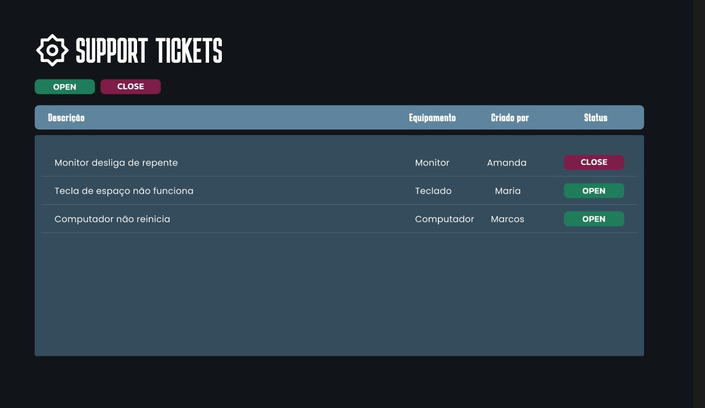

# 🎫 Support Tickets API

API de gerenciamento de tickets de suporte, desenvolvida em **Node.js** puro, com foco em modularidade, organização de código e boas práticas de arquitetura.

Imagem meramente ilustrativa feita no figma para representar uma interface

## ✨ Sobre o Projeto

Este projeto tem como objetivo fornecer uma API simples e escalável para gerenciamento de tickets de suporte.

A API está estruturada em módulos claros:
- Controllers: Lógica para criação, atualização e listagem de tickets.
- Database: Simulação de banco de dados utilizando JSON para persistência.
- Middlewares: Tratamento do corpo da requisição (JSON) e gerenciamento de rotas.
- Routes: Definição das rotas disponíveis.
- Utils: Funções auxiliares para suporte às operações.
- Server: Inicialização do servidor e integração dos módulos.

## 🛠️ Tecnologias Utilizadas

Node.js – Ambiente de execução JavaScript no servidor
JavaScript (ESM) – Estrutura modular e organizada
JSON – Persistência de dados local (db.json)
HTTP nativo do Node – Sem frameworks externos, construído do zero
Middlewares customizados – Para parsing de JSON e roteamento manual

### 📌 Funcionalidades

- Criar novo ticket de suporte
- Listar tickets existentes
- Atualizar status ou informações de um ticket
- Aplicar solução para mudar status
- Remover ticket
- Persistência em arquivo db.json

**🧠  Ensinando por Rocketseat e aplicado por Amanda Santana**